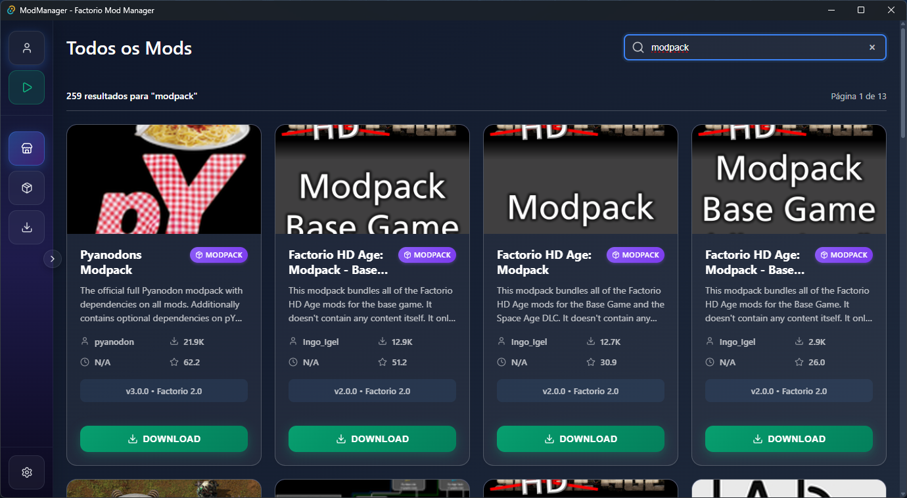

<div id="top">

<!-- HEADER STYLE: CLASSIC -->
<div align="center">

# FACTORIO-MANAGER

<em></em>

<!-- BADGES -->
<!-- local repository, no metadata badges. -->

<em>Built with the tools and technologies:</em>


<br>


</div>
<br>

---

## Table of Contents

- [Table of Contents](#table-of-contents)
- [Overview](#overview)
- [Features](#features)
- [Project Structure](#project-structure)
    - [Project Index](#project-index)
- [Getting Started](#getting-started)
    - [Prerequisites](#prerequisites)
    - [Installation](#installation)
    - [Usage](#usage)
    - [Testing](#testing)
- [Roadmap](#roadmap)
- [Contributing](#contributing)
- [License](#license)
- [Acknowledgments](#acknowledgments)

---

## Overview

Abbyte Manager is a desktop Factorio mod manager built with Tauri (Rust backend) and React/TypeScript. It is an academic, non‑profit project intended for study and personal use.

Disclaimer: This project is not affiliated with, endorsed by, or associated with Wube Software/Factorio. Trademarks and names belong to their respective owners.


---

## Features

|      | Component       | Details |
| :--- | :-------------- | :------ |
| ⚙️  | **Architecture**  | <ul><li>Hybrid Tauri app: <strong>Rust</strong> backend + <strong>React 18</strong> + <strong>TypeScript 5</strong> front‑end</li><li>Bundled with <strong>Vite 4</strong> for fast dev server & HMR</li><li>Cross‑platform (Windows, macOS, Linux) via Tauri’s native layer</li></ul> |
| 🔩 | **Code Quality**  | <ul><li>TypeScript strict mode enabled (`tsconfig.json`)</li><li>ESLint + Prettier configured (see `.eslintrc.js`, `.prettierrc`)</li><li>Rust clippy & rustfmt enforced in CI (`cargo clippy`, `cargo fmt`)</li></ul> |

---

### Functional Features

- Mods catalog (official API): search by name, basic filters, local cache; backend proxy to avoid CORS in the frontend
- Mod details & releases: dependency resolution aligned to the Factorio version required by the parent mod; ignores `base` and optional/incompatible markers
- Robust download queue: tabs for All, Downloaded, Pending; pause/resume/clear; buffered writes, throttled progress; stall detection and resume via HTTP Range
- My Mods: scrollable list with bulk actions — Enable all, Disable all (yellow style), Delete all (with confirmation)
- Profiles: create/edit/delete; each profile has its own mods/config folders; active profile persisted in `AppData/Roaming/ModManager/.config`; automatic link of Factorio’s `mods` directory to the active profile’s mods folder
  - Windows: uses directory junction (`mklink /J`) without admin privileges; if a real `mods` folder exists, it is backed up to `mods-backup[-timestamp]`
- Run the game (RUN): sidebar button; uses profile-specific executable path if defined or the global path; opens a selector and saves as default when missing

## Screenshots

1. Mods Screen


2. Mod Details


3. My Downloaded Mods


4. Download Queue


5. Profiles


## Project Structure

```sh
└── Abbyte-Manager-main/
    ├── .github
    │   ├── chatmodes
    │   ├── instructions
    │   └── prompts
    ├── dev.bat
    ├── example
    │   ├── AutoDeconstruct.json
    │   ├── index.py
    │   └── mod-response.json
    ├── index.html
    ├── package-lock.json
    ├── package.json
    ├── public
    │   ├── tauri.svg
    │   └── vite.svg
    ├── README.md
    ├── src
    │   ├── App.css
    │   ├── App.tsx
    │   ├── AppNew.tsx
    │   ├── assets
    │   ├── components
    │   ├── context
    │   ├── contexts
    │   ├── hooks
    │   ├── main.tsx
    │   ├── styles
    │   ├── types
    │   └── vite-env.d.ts
    ├── src-tauri
    │   ├── .gitignore
    │   ├── build.rs
    │   ├── capabilities
    │   ├── Cargo.lock
    │   ├── Cargo.toml
    │   ├── icons
    │   ├── src
    │   └── tauri.conf.json
    ├── target
    │   └── rust-analyzer
    ├── tsconfig.json
    ├── tsconfig.node.json
    ├── vite.config.ts
    └── vs_buildtools.exe
```

### Project Index

<details open>
	<summary><b><code>ABBYTE-MANAGER-MAIN/</code></b></summary>
	<!-- __root__ Submodule -->
	<details>
		<summary><b>__root__</b></summary>
		<blockquote>
			<div class='directory-path' style='padding: 8px 0; color: #666;'>
				<code><b>⦿ __root__</b></code>
			<table style='width: 100%; border-collapse: collapse;'>
			<thead>
				<tr style='background-color: #f8f9fa;'>
					<th style='width: 30%; text-align: left; padding: 8px;'>File Name</th>
					<th style='text-align: left; padding: 8px;'>Summary</th>
				</tr>
			</thead>
				<tr style='border-bottom: 1px solid #eee;'>
					<td style='padding: 8px;'><b><a href='Abbyte-Manager-main/Abbyte-Manager-main/dev.bat'>dev.bat</a></b></td>
					<td style='padding: 8px;'>- Launches the Factorio Mod Manager development environment by initializing Visual Studio command tools and starting the Tauri development server<br>- It displays a startup message, sets up the required build context, and triggers the local build and hot‑reload process for the application, enabling developers to iterate quickly on the desktop interface and underlying logic.</td>
				</tr>
				<tr style='border-bottom: 1px solid #eee;'>
					<td style='padding: 8px;'><b><a href='Abbyte-Manager-main/Abbyte-Manager-main/index.html'>index.html</a></b></td>
					<td style='padding: 8px;'>- Provides the foundational HTML structure for the Tauri application, establishing the document head with charset, viewport, title, and favicon, and creating a root div for React rendering<br>- It loads the main TypeScript entry point, enabling the React component tree to mount within the webview, thereby serving as the single‑page interface that Tauri displays.</td>
				</tr>
				<tr style='border-bottom: 1px solid #eee;'>
					<td style='padding: 8px;'><b><a href='Abbyte-Manager-main/Abbyte-Manager-main/package-lock.json'>package-lock.json</a></b></td>
					<td style='padding: 8px;'>- Package-lock.json – Dependency Snapshot for the Tauri‑React App**This file records the exact versions of every npm package that the project relies on, from the core Tauri APIs and plugins to the React UI stack and icon library<br>- By locking these versions, it guarantees that every developer, CI pipeline, and production deployment installs the same dependency tree, preventing “works‑on‑my‑machine” surprises<br>- In the overall architecture, it sits beside the <code>package.json</code> and the Tauri configuration, ensuring that the front‑end React code and the Tauri backend share a consistent, reproducible runtime environment.</td>
				</tr>
				<tr style='border-bottom: 1px solid #eee;'>
					<td style='padding: 8px;'><b><a href='Abbyte-Manager-main/Abbyte-Manager-main/package.json'>package.json</a></b></td>
					<td style='padding: 8px;'>- Defines project metadata, scripts for development, build, preview, and Tauri integration, and lists runtime and development dependencies for a React‑based Tauri desktop application<br>- It configures Vite and TypeScript tooling, specifies React and Tauri API plugins, and establishes build pipelines that compile TypeScript, bundle assets, and launch the native Tauri runtime<br>- This central configuration enables seamless development, testing,</td>
				</tr>
				<tr style='border-bottom: 1px solid #eee;'>
					<td style='padding: 8px;'><b><a href='Abbyte-Manager-main/Abbyte-Manager-main/tsconfig.json'>tsconfig.json</a></b></td>
					<td style='padding: 8px;'>- Configures TypeScript compiler to enforce strict typing, modern ES2020 features, and React JSX support across the project, while enabling bundler‑friendly module resolution and JSON imports<br>- It references a node‑specific config, includes source files, and disables emission to integrate with a build pipeline that handles bundling and linting, ensuring consistent type safety and build behavior across all modules.</td>
				</tr>
				<tr style='border-bottom: 1px solid #eee;'>
					<td style='padding: 8px;'><b><a href='Abbyte-Manager-main/Abbyte-Manager-main/tsconfig.node.json'>tsconfig.node.json</a></b></td>
					<td style='padding: 8px;'>- Configure TypeScript for Vite build scripts, enabling ESNext modules, bundler resolution, and synthetic default imports while skipping library checks and supporting composite projects<br>- Includes only the Vite configuration file, ensuring a streamlined build setup that integrates seamlessly with the overall project architecture<br>- This configuration also specifies module resolution strategy tailored for bundler environments, facilitating efficient dependency handling during development and production builds.</td>
				</tr>
				<tr style='border-bottom: 1px solid #eee;'>
					<td style='padding: 8px;'><b><a href='Abbyte-Manager-main/Abbyte-Manager-main/vite.config.ts'>vite.config.ts</a></b></td>
					<td style='padding: 8px;'>- Configure Vite to integrate with Tauri, enabling React support, enforcing a fixed development port, preserving Rust error visibility, and tailoring hot‑module replacement for remote hosts<br>- It also excludes the Tauri source directory from file watching, ensuring a smooth build and dev experience for the desktop application, and streamlines communication between the frontend and Rust backend.</td>
				</tr>
			</table>
		</blockquote>
	</details>
	<!-- example Submodule -->
	<details>
		<summary><b>example</b></summary>
		<blockquote>
			<div class='directory-path' style='padding: 8px 0; color: #666;'>
				<code><b>⦿ example</b></code>
			<table style='width: 100%; border-collapse: collapse;'>
			<thead>
				<tr style='background-color: #f8f9fa;'>
					<th style='width: 30%; text-align: left; padding: 8px;'>File Name</th>
					<th style='text-align: left; padding: 8px;'>Summary</th>
				</tr>
			</thead>
				<tr style='border-bottom: 1px solid #eee;'>
					<td style='padding: 8px;'><b><a href='Abbyte-Manager-main/Abbyte-Manager-main/example/AutoDeconstruct.json'>AutoDeconstruct.json</a></b></td>
					<td style='padding: 8px;'>- Display accurate release notes to users.-Load the correct translation strings from Crowdin.-Apply the latest bug‑fixes and feature changes automatically<br>- Thus, <em>AutoDeconstruct.json</em> is the central reference point that keeps the AutoDeconstruct feature up‑to‑date and properly integrated with the project’s utilities subsystem.</td>
				</tr>
				<tr style='border-bottom: 1px solid #eee;'>
					<td style='padding: 8px;'><b><a href='Abbyte-Manager-main/Abbyte-Manager-main/example/index.py'>index.py</a></b></td>
					<td style='padding: 8px;'>- Download Factorio mod packs by analyzing URLs, constructing dependency trees, and fetching required mods concurrently through a custom GUI<br>- Orchestrate API calls to retrieve metadata, resolve versions, and manage parallel downloads while updating progress and logs<br>- Integrate with local storage to persist files and maintain a record of processed mods, enabling efficient mod pack assembly within the application.</td>
				</tr>
				<tr style='border-bottom: 1px solid #eee;'>
					<td style='padding: 8px;'><b><a href='Abbyte-Manager-main/Abbyte-Manager-main/example/mod-response.json'>mod-response.json</a></b></td>
					<td style='padding: 8px;'>- Communicate<strong> to clients (e.g., a mod‑pack manager or UI) which mods have new releases<br>- 2<br>- </strong>Provide** a concise change log that can be displayed to users, helping them decide whether to apply the update<br>- Thus, <code>mod-response.json</code> is the bridge between the backend update logic and the front‑end or CLI that presents mod‑pack updates to end users.</td>
				</tr>
			</table>
		</blockquote>
	</details>
	<!-- src Submodule -->
	<details>
		<summary><b>src</b></summary>
		<blockquote>
			<div class='directory-path' style='padding: 8px 0; color: #666;'>
				<code><b>⦿ src</b></code>
			<table style='width: 100%; border-collapse: collapse;'>
			<thead>
				<tr style='background-color: #f8f9fa;'>
					<th style='width: 30%; text-align: left; padding: 8px;'>File Name</th>
					<th style='text-align: left; padding: 8px;'>Summary</th>
				</tr>
			</thead>
				<tr style='border-bottom: 1px solid #eee;'>
					<td style='padding: 8px;'><b><a href='Abbyte-Manager-main/Abbyte-Manager-main/src/App.css'>App.css</a></b></td>
					<td style='padding: 8px;'>- File Summary – <code>src/App.css</code>**<code>src/App.css</code> serves as the central styling foundation for the entire application<br>- It establishes the global visual language—defining typography, color palette, and layout defaults—so that every component inherits a consistent look and feel<br>- By declaring CSS custom properties (e.g., <code>--primary-color</code>, <code>--danger-color</code>) and base styles for text, backgrounds, and borders, this file ensures that the UI remains cohesive, accessible, and easy to theme across the codebase.</td>
				</tr>
				<tr style='border-bottom: 1px solid #eee;'>
					<td style='padding: 8px;'><b><a href='Abbyte-Manager-main/Abbyte-Manager-main/src/App.tsx'>App.tsx</a></b></td>
					<td style='padding: 8px;'>- Orchestrates the main application layout, managing navigation between tabs, mod details, and profile operations while coordinating error handling and context providers<br>- It integrates sidebar, main content, profile modals, and a dependency banner, ensuring state persistence, profile selection, and modal visibility across the Tauri‑based Factorio mod manager<br>- It also persists tab state, responds to</td>
				</tr>
				<tr style='border-bottom: 1px solid #eee;'>
					<td style='padding: 8px;'><b><a href='Abbyte-Manager-main/Abbyte-Manager-main/src/AppNew.tsx'>AppNew.tsx</a></b></td>
					<td style='padding: 8px;'>- Establishes the root component, orchestrating navigation, global state, and theming across the application<br>- It integrates routing logic, context providers, and layout scaffolding, ensuring consistent UI and data flow<br>- By centralizing these concerns, it simplifies component composition and promotes maintainable architecture<br>- The component serves as the entry point for rendering child views and handling user interactions.</td>
				</tr>
				<tr style='border-bottom: 1px solid #eee;'>
					<td style='padding: 8px;'><b><a href='Abbyte-Manager-main/Abbyte-Manager-main/src/main.tsx'>main.tsx</a></b></td>
					<td style='padding: 8px;'>- Bootstraps the React application by rendering the root component into the DOM, initializing the UI layer and enabling strict mode checks<br>- It imports the main App component, attaches it to the root element, and establishes the entry point for the entire front‑end architecture, ensuring that the component tree mounts correctly and that React's development features are active.</td>
				</tr>
				<tr style='border-bottom: 1px solid #eee;'>
					<td style='padding: 8px;'><b><a href='Abbyte-Manager-main/Abbyte-Manager-main/src/vite-env.d.ts'>vite-env.d.ts</a></b></td>
					<td style='padding: 8px;'>- Enables TypeScript to recognize Vite client APIs, ensuring accurate type checking and editor support across the project<br>- By referencing Vite’s client types, it integrates Vite’s development utilities into the global namespace, allowing developers to leverage hot module replacement and other Vite features with full type safety<br>- This declaration file is essential for a smooth development workflow in the Vite‑powered application.</td>
				</tr>
			</table>
			<!-- components Submodule -->
			<details>
				<summary><b>components</b></summary>
				<blockquote>
					<div class='directory-path' style='padding: 8px 0; color: #666;'>
						<code><b>⦿ src.components</b></code>
					<table style='width: 100%; border-collapse: collapse;'>
					<thead>
						<tr style='background-color: #f8f9fa;'>
							<th style='width: 30%; text-align: left; padding: 8px;'>File Name</th>
							<th style='text-align: left; padding: 8px;'>Summary</th>
						</tr>
					</thead>
						<tr style='border-bottom: 1px solid #eee;'>
							<td style='padding: 8px;'><b><a href='Abbyte-Manager-main/Abbyte-Manager-main/src/components/AllModsView.tsx'>AllModsView.tsx</a></b></td>
							<td style='padding: 8px;'>- Displays a searchable, paginated grid of Factorio mods, fetching thumbnails and metadata, enabling navigation to detailed views, and facilitating versioned downloads through a modal<br>- It coordinates search state, scroll restoration, and user feedback, integrating hooks for data retrieval and thumbnail caching within the broader mod‑browser architecture, ensuring consistent user experience across tabs and preserving scroll positions.</td>
						</tr>
						<tr style='border-bottom: 1px solid #eee;'>
							<td style='padding: 8px;'><b><a href='Abbyte-Manager-main/Abbyte-Manager-main/src/components/CacheStatus.tsx'>CacheStatus.tsx</a></b></td>
							<td style='padding: 8px;'>- Displays real‑time status of the mods cache, indicating loading, updating, errors, or validity, and shows the number of cached mods and last refresh time<br>- Provides a button to force a cache update, integrating with the useModsCache hook to keep the UI in sync with the underlying cache state and feedback.</td>
						</tr>
						<tr style='border-bottom: 1px solid #eee;'>
							<td style='padding: 8px;'><b><a href='Abbyte-Manager-main/Abbyte-Manager-main/src/components/ConfigModal.tsx'>ConfigModal.tsx</a></b></td>
							<td style='padding: 8px;'>- Provides a modal interface for adjusting application settings, integrating with global state and validation logic to ensure user inputs are correctly captured and persisted<br>- It connects to the configuration store, renders form controls for various options, and handles submission and cancellation actions, enabling users to customize behavior without leaving the current context.</td>
						</tr>
						<tr style='border-bottom: 1px solid #eee;'>
							<td style='padding: 8px;'><b><a href='Abbyte-Manager-main/Abbyte-Manager-main/src/components/ConfigView.tsx'>ConfigView.tsx</a></b></td>
							<td style='padding: 8px;'>- Provides a settings interface for ModManager, enabling users to specify the Factorio executable path, configure automatic cache refresh intervals, view cache statistics, and trigger manual cache updates<br>- It persists configuration via Tauri backend, validates paths, and displays real‑time cache status, integrating with the global mods cache hook to keep the UI in sync with the application state.</td>
						</tr>
						<tr style='border-bottom: 1px solid #eee;'>
							<td style='padding: 8px;'><b><a href='Abbyte-Manager-main/Abbyte-Manager-main/src/components/DependencyBanner.tsx'>DependencyBanner.tsx</a></b></td>
							<td style='padding: 8px;'>- Displays real‑time dependency analysis progress banner in the UI, reacting to Tauri events, updating visibility and progress metrics, and hiding after completion or error<br>- It integrates with the app’s event system to provide users with immediate feedback during dependency resolution, enhancing transparency and user experience during build or analysis phases.</td>
						</tr>
						<tr style='border-bottom: 1px solid #eee;'>
							<td style='padding: 8px;'><b><a href='Abbyte-Manager-main/Abbyte-Manager-main/src/components/DependencyModal.tsx'>DependencyModal.tsx</a></b></td>
							<td style='padding: 8px;'>Displays a modal dialog presenting</td>
						</tr>
						<tr style='border-bottom: 1px solid #eee;'>
							<td style='padding: 8px;'><b><a href='Abbyte-Manager-main/Abbyte-Manager-main/src/components/DownloadQueue.tsx'>DownloadQueue.tsx</a></b></td>
							<td style='padding: 8px;'>- Displays and manages the download queue for the active user profile, presenting current, upcoming, and completed items with progress, speed, and ETA<br>- Provides controls to pause, resume, cancel, prioritize, or clear downloads, and shows aggregate statistics such as total, pending, and completed counts<br>- Integrates with the global download hook and profile context to filter items by profile.</td>
						</tr>
						<tr style='border-bottom: 1px solid #eee;'>
							<td style='padding: 8px;'><b><a href='Abbyte-Manager-main/Abbyte-Manager-main/src/components/ErrorModal.tsx'>ErrorModal.tsx</a></b></td>
							<td style='padding: 8px;'>- Displays a modal dialog that surfaces error information to users, offering options to copy details to the clipboard or download a log file<br>- It listens for the Escape key to close, formats timestamps, and presents title, message, technical details, and stack trace<br>- The component integrates with the app’s global error handling, ensuring consistent user feedback across the interface.</td>
						</tr>
						<tr style='border-bottom: 1px solid #eee;'>
							<td style='padding: 8px;'><b><a href='Abbyte-Manager-main/Abbyte-Manager-main/src/components/InstalledModsList.tsx'>InstalledModsList.tsx</a></b></td>
							<td style='padding: 8px;'>- Showcases the current collection of installed mods, presenting each with its name, version, and status<br>- Enables users to perform actions such as uninstalling, updating, or inspecting mod details<br>- Integrates with the global state layer to reflect real‑time changes and communicates with backend services for data persistence<br>- Serves as the central UI element for mod management within the application.</td>
						</tr>
						<tr style='border-bottom: 1px solid #eee;'>
							<td style='padding: 8px;'><b><a href='Abbyte-Manager-main/Abbyte-Manager-main/src/components/MainContent.tsx'>MainContent.tsx</a></b></td>
							<td style='padding: 8px;'>- Renders the main content area, dynamically selecting between all mods, my mods, download queue, config, and mod details views according to the active tab and payload<br>- It forwards navigation callbacks, handles dependency opening, and ensures a cohesive user experience across the application’s core sections<br>- This component serves as the central switchboard for the UI, coordinating view transitions and data flow.</td>
						</tr>
						<tr style='border-bottom: 1px solid #eee;'>
							<td style='padding: 8px;'><b><a href='Abbyte-Manager-main/Abbyte-Manager-main/src/components/ModDetailsView.css'>ModDetailsView.css</a></b></td>
							<td style='padding: 8px;'>- Styles the ModDetailsView component, establishing layout, spacing, and visual hierarchy for mod metadata, image carousel, dependency tags, and release listings<br>- It defines button, chip, and link appearances, ensuring responsive design and consistent theming across the application<br>- By applying these styles</td>
						</tr>
						<tr style='border-bottom: 1px solid #eee;'>
							<td style='padding: 8px;'><b><a href='Abbyte-Manager-main/Abbyte-Manager-main/src/components/ModDetailsView.tsx'>ModDetailsView.tsx</a></b></td>
							<td style='padding: 8px;'>- Displays comprehensive mod details, fetching full data from the backend and presenting images, dependencies, and release history<br>- It offers navigation back to the mod list, a download modal, and handles loading and error states<br>- By integrating with Tauri commands, it enables users to explore, download, and manage mods directly within the Factorio mod manager interface.</td>
						</tr>
						<tr style='border-bottom: 1px solid #eee;'>
							<td style='padding: 8px;'><b><a href='Abbyte-Manager-main/Abbyte-Manager-main/src/components/ModPlaceholder.tsx'>ModPlaceholder.tsx</a></b></td>
							<td style='padding: 8px;'>- Provides a scalable SVG placeholder representing a mod package icon, used throughout the UI to indicate missing or loading mod assets<br>- Accepts size and className props for flexible styling, integrating seamlessly with the component hierarchy and theming system<br>- The graphic features a gradient background, package silhouette, and gear overlay, making it a consistent stand‑in for mod thumbnails in lists and detail views.</td>
						</tr>
						<tr style='border-bottom: 1px solid #eee;'>
							<td style='padding: 8px;'><b><a href='Abbyte-Manager-main/Abbyte-Manager-main/src/components/ModThumbnail.tsx'>ModThumbnail.tsx</a></b></td>
							<td style='padding: 8px;'>Displays mod thumbnails with lazy loading, caching, error handling, and placeholder fallback</td>
						</tr>
						<tr style='border-bottom: 1px solid #eee;'>
							<td style='padding: 8px;'><b><a href='Abbyte-Manager-main/Abbyte-Manager-main/src/components/ModVersionModal.tsx'>ModVersionModal.tsx</a></b></td>
							<td style='padding: 8px;'>- Shows a modal that lists all released versions of a Factorio mod, letting users pick a specific release<br>- Upon selection, it initiates backend dependency resolution and queues the download for the currently active profile, while displaying loading indicators and handling errors<br>- The component ties the UI to the global profile context and communicates with the Tauri backend to manage mod installation.</td>
						</tr>
						<tr style='border-bottom: 1px solid #eee;'>
							<td style='padding: 8px;'><b><a href='Abbyte-Manager-main/Abbyte-Manager-main/src/components/MyModsView.css'>MyModsView.css</a></b></td>
							<td style='padding: 8px;'>- Styles the My Mods view, enabling a scrollable list, defining header layout, bulk action buttons, and custom scrollbar appearance<br>- Provides responsive spacing, button states, and a yellow pause‑all button style, ensuring consistent UI across the application<br>- The CSS also supports flex layout for dynamic resizing, improves usability for bulk operations, and enhances visual feedback during progress updates.</td>
						</tr>
						<tr style='border-bottom: 1px solid #eee;'>
							<td style='padding: 8px;'><b><a href='Abbyte-Manager-main/Abbyte-Manager-main/src/components/MyModsView.tsx'>MyModsView.tsx</a></b></td>
							<td style='padding: 8px;'>- Displays and manages a user’s installed mods within the Factorio profile manager, enabling search, individual and bulk enable/disable, and deletion with confirmation<br>- It fetches data from the Tauri backend, reflects real‑time status, and updates the global profile context<br>- The component provides a responsive UI with loading, error handling, and modal dialogs for safe removal of mods.</td>
						</tr>
						<tr style='border-bottom: 1px solid #eee;'>
							<td style='padding: 8px;'><b><a href='Abbyte-Manager-main/Abbyte-Manager-main/src/components/ProfileCreation.tsx'>ProfileCreation.tsx</a></b></td>
							<td style='padding: 8px;'>- Creates and validates new user profiles, allowing custom mod directories and executable paths, and communicates with the backend to persist data<br>- It provides a form with real‑time validation, folder preview, and navigation controls, integrating with the app’s state and triggering callbacks when a profile is successfully created or the user returns to the previous view.</td>
						</tr>
						<tr style='border-bottom: 1px solid #eee;'>
							<td style='padding: 8px;'><b><a href='Abbyte-Manager-main/Abbyte-Manager-main/src/components/ProfileCreationModal.tsx'>ProfileCreationModal.tsx</a></b></td>
							<td style='padding: 8px;'>- Creates a modal dialog that lets users define a new profile, specifying name, optional custom mods directory, and optional Factorio executable path, validates inputs, previews folder path, and submits data to backend to create profile<br>- It integrates with Tauris file dialog and backend validation, supports ESC key closure, resets state on close, and triggers a callback upon successful creation.</td>
						</tr>
						<tr style='border-bottom: 1px solid #eee;'>
							<td style='padding: 8px;'><b><a href='Abbyte-Manager-main/Abbyte-Manager-main/src/components/ProfileModal.tsx'>ProfileModal.tsx</a></b></td>
							<td style='padding: 8px;'>- Manages user profiles, providing a modal interface for listing, selecting, editing, and deleting profiles<br>- It coordinates with the Tauri backend to persist changes, validate paths, and update the active profile state<br>- The component integrates escape‑key handling and ensures the UI reflects profile metadata, creation dates, and default status and user.</td>
						</tr>
						<tr style='border-bottom: 1px solid #eee;'>
							<td style='padding: 8px;'><b><a href='Abbyte-Manager-main/Abbyte-Manager-main/src/components/ProfileModalNew.tsx'>ProfileModalNew.tsx</a></b></td>
							<td style='padding: 8px;'>- Provides a modal dialog for viewing and editing user profile details, integrating with the global state and API services to fetch and update user data<br>- It leverages the design system for consistent styling, handles form validation, and triggers side effects such as notifications and navigation upon successful updates<br>- This component is central to the user account management flow within the application.</td>
						</tr>
						<tr style='border-bottom: 1px solid #eee;'>
							<td style='padding: 8px;'><b><a href='Abbyte-Manager-main/Abbyte-Manager-main/src/components/Settings.tsx'>Settings.tsx</a></b></td>
							<td style='padding: 8px;'>- Provides a user‑centered interface for configuring application preferences, including theme selection, notification toggles, and account details<br>- Integrates with global state and API services to persist changes, while ensuring accessibility and responsive design<br>- Serves as the primary entry point for the Settings section, coordinating sub‑components and validation logic within the overall component architecture.</td>
						</tr>
						<tr style='border-bottom: 1px solid #eee;'>
							<td style='padding: 8px;'><b><a href='Abbyte-Manager-main/Abbyte-Manager-main/src/components/Sidebar.tsx'>Sidebar.tsx</a></b></td>
							<td style='padding: 8px;'>- Provides a responsive sidebar navigation for the Factorio mod manager, displaying user profile, run button, and tabs for all mods, personal mods, download queue, and configuration<br>- It manages active tab state, auto‑collapses on narrow screens, and handles launching the game, including path selection and configuration updates<br>- The component integrates with Tauri APIs to execute native actions and update UI accordingly.</td>
						</tr>
						<tr style='border-bottom: 1px solid #eee;'>
							<td style='padding: 8px;'><b><a href='Abbyte-Manager-main/Abbyte-Manager-main/src/components/ThumbnailUpdateButton.tsx'>ThumbnailUpdateButton.tsx</a></b></td>
							<td style='padding: 8px;'>- Provides a button to fetch and update thumbnails for the most popular mods, displaying progress, success, and error states, and notifying parent components upon completion<br>- It integrates with the global thumbnail state via a custom hook, dynamically adjusts styling and text based on update status, and offers optional callbacks for external handling.</td>
						</tr>
					</table>
				</blockquote>
			</details>
			<!-- context Submodule -->
			<details>
				<summary><b>context</b></summary>
				<blockquote>
					<div class='directory-path' style='padding: 8px 0; color: #666;'>
						<code><b>⦿ src.context</b></code>
					<table style='width: 100%; border-collapse: collapse;'>
					<thead>
						<tr style='background-color: #f8f9fa;'>
							<th style='width: 30%; text-align: left; padding: 8px;'>File Name</th>
							<th style='text-align: left; padding: 8px;'>Summary</th>
						</tr>
					</thead>
						<tr style='border-bottom: 1px solid #eee;'>
							<td style='padding: 8px;'><b><a href='Abbyte-Manager-main/Abbyte-Manager-main/src/context/ProfileContext.tsx'>ProfileContext.tsx</a></b></td>
							<td style='padding: 8px;'>- Provides global state for user profiles, enabling components to access the profile list, active profile, and control profile selection while synchronizing with backend and local storage<br>- It initializes profiles on startup, offers hooks for consuming components, and updates Factorio mod links when a profile changes<br>- This centralizes profile management across the application.</td>
						</tr>
					</table>
				</blockquote>
			</details>
			<!-- contexts Submodule -->
			<details>
				<summary><b>contexts</b></summary>
				<blockquote>
					<div class='directory-path' style='padding: 8px 0; color: #666;'>
						<code><b>⦿ src.contexts</b></code>
					<table style='width: 100%; border-collapse: collapse;'>
					<thead>
						<tr style='background-color: #f8f9fa;'>
							<th style='width: 30%; text-align: left; padding: 8px;'>File Name</th>
							<th style='text-align: left; padding: 8px;'>Summary</th>
						</tr>
					</thead>
						<tr style='border-bottom: 1px solid #eee;'>
							<td style='padding: 8px;'><b><a href='Abbyte-Manager-main/Abbyte-Manager-main/src/contexts/ErrorContext.tsx'>ErrorContext.tsx</a></b></td>
							<td style='padding: 8px;'>- Establishes a global error handling context that supplies components with showError and handleAsyncError utilities, ensuring consistent error presentation and streamlined async error management throughout the application<br>- By wrapping the component tree with ErrorProvider, any child can invoke standardized error handling, centralizing logic and simplifying debugging across the codebase, and fostering maintainable, scalable error handling patterns.</td>
						</tr>
						<tr style='border-bottom: 1px solid #eee;'>
							<td style='padding: 8px;'><b><a href='Abbyte-Manager-main/Abbyte-Manager-main/src/contexts/NotificationContext.tsx'>NotificationContext.tsx</a></b></td>
							<td style='padding: 8px;'>- Centralizes notification handling by exposing a context that components can consume to trigger alerts, manage visibility, and customize appearance, ensuring consistent messaging throughout the application<br>- Integrates with the UI layer to display toast notifications, supports multiple notification types, and offers hooks for easy consumption across the component tree<br>- and efficiently</td>
						</tr>
						<tr style='border-bottom: 1px solid #eee;'>
							<td style='padding: 8px;'><b><a href='Abbyte-Manager-main/Abbyte-Manager-main/src/contexts/ProfileContext.tsx'>ProfileContext.tsx</a></b></td>
							<td style='padding: 8px;'>- Offers a centralized store for user profile data, including authentication status, personal details, and preferences<br>- Supplies a provider component that wraps the app, exposing context values and updater functions to child components<br>- Enables seamless access to profile information across the component tree, simplifying state management and ensuring consistent updates throughout the UI.</td>
						</tr>
					</table>
				</blockquote>
			</details>
			<!-- hooks Submodule -->
			<details>
				<summary><b>hooks</b></summary>
				<blockquote>
					<div class='directory-path' style='padding: 8px 0; color: #666;'>
						<code><b>⦿ src.hooks</b></code>
					<table style='width: 100%; border-collapse: collapse;'>
					<thead>
						<tr style='background-color: #f8f9fa;'>
							<th style='width: 30%; text-align: left; padding: 8px;'>File Name</th>
							<th style='text-align: left; padding: 8px;'>Summary</th>
						</tr>
					</thead>
						<tr style='border-bottom: 1px solid #eee;'>
							<td style='padding: 8px;'><b><a href='Abbyte-Manager-main/Abbyte-Manager-main/src/hooks/useDownloadQueue.tsx'>useDownloadQueue.tsx</a></b></td>
							<td style='padding: 8px;'>- Provides a React hook that manages the download queue, enabling components to enqueue, pause, resume, and remove downloads while synchronizing with the Tauri backend through event listeners<br>- It exposes functions for queue manipulation, tracks progress, and updates the UI reactively<br>- By integrating with the Rust backend, it ensures real‑time synchronization of download statuses across the application, allowing users to manage multiple mod downloads efficiently.</td>
						</tr>
						<tr style='border-bottom: 1px solid #eee;'>
							<td style='padding: 8px;'><b><a href='Abbyte-Manager-main/Abbyte-Manager-main/src/hooks/useErrorHandler.ts'>useErrorHandler.ts</a></b></td>
							<td style='padding: 8px;'>- Centralizes error handling across the application, offering stateful error information, modal visibility control, and utilities to display, hide, and log errors<br>- It also wraps asynchronous operations, capturing failures and presenting user‑friendly messages while preserving stack traces for debugging<br>- This hook integrates seamlessly with the UI layer, ensuring consistent error presentation and streamlined debugging.</td>
						</tr>
						<tr style='border-bottom: 1px solid #eee;'>
							<td style='padding: 8px;'><b><a href='Abbyte-Manager-main/Abbyte-Manager-main/src/hooks/useErrorHandler.tsx'>useErrorHandler.tsx</a></b></td>
							<td style='padding: 8px;'>- Centralizes error handling across the application by exposing a hook that components can invoke to report errors<br>- It integrates with the global error context, logs incidents to an external monitoring service, and triggers user‑facing notifications<br>- This approach ensures consistent error reporting, simplifies debugging, and enhances user experience by providing clear feedback when failures occur.</td>
						</tr>
						<tr style='border-bottom: 1px solid #eee;'>
							<td style='padding: 8px;'><b><a href='Abbyte-Manager-main/Abbyte-Manager-main/src/hooks/useEscapeKey.ts'>useEscapeKey.ts</a></b></td>
							<td style='padding: 8px;'>- Enables modal dismissal via the Escape key, integrating with the app’s modal system by monitoring key events when a modal is open and invoking the provided close handler<br>- This hook centralizes keyboard accessibility logic, ensuring consistent behavior across dialogs and improving user experience without scattering event listeners throughout components<br>- It also cleans up listeners on unmount, preventing memory leaks.</td>
						</tr>
						<tr style='border-bottom: 1px solid #eee;'>
							<td style='padding: 8px;'><b><a href='Abbyte-Manager-main/Abbyte-Manager-main/src/hooks/useModsCache.ts'>useModsCache.ts</a></b></td>
							<td style='padding: 8px;'>- Manages local cache of mods, ensuring data freshness and availability for the application<br>- It checks cache validity, loads stored data, and triggers full updates when necessary<br>- The hook exposes loading, updating, age, total count, error, and validity states, along with a force update function<br>- It integrates with the Tauri backend, keeping the UI in sync with the underlying cache.</td>
						</tr>
						<tr style='border-bottom: 1px solid #eee;'>
							<td style='padding: 8px;'><b><a href='Abbyte-Manager-main/Abbyte-Manager-main/src/hooks/useModsSearch.ts'>useModsSearch.ts</a></b></td>
							<td style='padding: 8px;'>Code>❯ REPLACE-ME</code></td>
						</tr>
						<tr style='border-bottom: 1px solid #eee;'>
							<td style='padding: 8px;'><b><a href='Abbyte-Manager-main/Abbyte-Manager-main/src/hooks/useModThumbnails.ts'>useModThumbnails.ts</a></b></td>
							<td style='padding: 8px;'>- Provides a reusable hook that manages thumbnail retrieval, caching, and background updates for mods, integrating with Tauri backend commands<br>- The hook exposes functions to fetch individual thumbnails with caching, clear the cache, and trigger bulk updates of popular mod thumbnails<br>- It also offers a helper to resolve a mod’s thumbnail URL, preferring enhanced thumbnails from the API, falling back to original assets, or returning null for placeholders<br>- This centralizes thumbnail logic, reduces redundant network calls, and keeps the UI responsive.</td>
						</tr>
					</table>
				</blockquote>
			</details>
			<!-- styles Submodule -->
			<details>
				<summary><b>styles</b></summary>
				<blockquote>
					<div class='directory-path' style='padding: 8px 0; color: #666;'>
						<code><b>⦿ src.styles</b></code>
					<table style='width: 100%; border-collapse: collapse;'>
					<thead>
						<tr style='background-color: #f8f9fa;'>
							<th style='width: 30%; text-align: left; padding: 8px;'>File Name</th>
							<th style='text-align: left; padding: 8px;'>Summary</th>
						</tr>
					</thead>
						<tr style='border-bottom: 1px solid #eee;'>
							<td style='padding: 8px;'><b><a href='Abbyte-Manager-main/Abbyte-Manager-main/src/styles/animations.css'>animations.css</a></b></td>
							<td style='padding: 8px;'>- Offers a collection of keyframe animations and utility classes that standardize motion across the application, enabling smooth transitions for modals, buttons, and navigation elements<br>- By centralizing animation logic, developers can maintain visual consistency, reduce duplication, and easily adjust timing or easing globally<br>- These styles integrate with component libraries and are referenced throughout the UI layer.</td>
						</tr>
						<tr style='border-bottom: 1px solid #eee;'>
							<td style='padding: 8px;'><b><a href='Abbyte-Manager-main/Abbyte-Manager-main/src/styles/DownloadQueue.css'>DownloadQueue.css</a></b></td>
							<td style='padding: 8px;'>- DownloadQueue.css<em>* This stylesheet provides the visual styling for the </em>Download Queue* component of the application<br>- It defines the overall layout, spacing, and color scheme that give the download queue a clean, consistent look within the user interface<br>- By centralizing these styles, the file ensures that the queue view remains cohesive with the rest of the app’s design system and can be easily maintained or updated without affecting other parts of the codebase.</td>
						</tr>
					</table>
				</blockquote>
			</details>
			<!-- types Submodule -->
			<details>
				<summary><b>types</b></summary>
				<blockquote>
					<div class='directory-path' style='padding: 8px 0; color: #666;'>
						<code><b>⦿ src.types</b></code>
					<table style='width: 100%; border-collapse: collapse;'>
					<thead>
						<tr style='background-color: #f8f9fa;'>
							<th style='width: 30%; text-align: left; padding: 8px;'>File Name</th>
							<th style='text-align: left; padding: 8px;'>Summary</th>
						</tr>
					</thead>
						<tr style='border-bottom: 1px solid #eee;'>
							<td style='padding: 8px;'><b><a href='Abbyte-Manager-main/Abbyte-Manager-main/src/types/index.ts'>index.ts</a></b></td>
							<td style='padding: 8px;'>- Defines core data structures for tab navigation and user profiles, enabling consistent state management across the application<br>- The ActiveTab type enumerates the possible views in the UI, while the Profile interface captures essential metadata for each user profile, such as name, folder location, and timestamps<br>- These types serve as the foundation for routing logic, configuration handling, and profile lifecycle operations throughout the codebase.</td>
						</tr>
					</table>
				</blockquote>
			</details>
		</blockquote>
	</details>
	<!-- src-tauri Submodule -->
	<details>
		<summary><b>src-tauri</b></summary>
		<blockquote>
			<div class='directory-path' style='padding: 8px 0; color: #666;'>
				<code><b>⦿ src-tauri</b></code>
			<table style='width: 100%; border-collapse: collapse;'>
			<thead>
				<tr style='background-color: #f8f9fa;'>
					<th style='width: 30%; text-align: left; padding: 8px;'>File Name</th>
					<th style='text-align: left; padding: 8px;'>Summary</th>
				</tr>
			</thead>
				<tr style='border-bottom: 1px solid #eee;'>
					<td style='padding: 8px;'><b><a href='Abbyte-Manager-main/Abbyte-Manager-main/src-tauri/build.rs'>build.rs</a></b></td>
					<td style='padding: 8px;'>- Builds the Tauri application, orchestrating native platform integration and packaging by invoking the Tauri build process during compilation<br>- This script ensures that platform‑specific binaries, resources, and configuration files are correctly assembled, enabling the desktop application to run seamlessly across Windows, macOS, and Linux<br>- By centralizing build logic, it simplifies maintenance and guarantees consistency across development and release pipelines.</td>
				</tr>
				<tr style='border-bottom: 1px solid #eee;'>
					<td style='padding: 8px;'><b><a href='Abbyte-Manager-main/Abbyte-Manager-main/src-tauri/Cargo.toml'>Cargo.toml</a></b></td>
					<td style='padding: 8px;'>- Defines the Rust backend for a Tauri application, specifying package metadata, library configuration, build dependencies, and runtime dependencies such as Tauri, plugins, serialization, networking, async runtime, and utilities<br>- It orchestrates how the native layer compiles into static, dynamic, and Rust libraries, enabling cross‑platform integration with the front‑end, ensuring seamless communication between the UI and system resources, and facilitating plugin integration for file dialogs and external links.</td>
				</tr>
				<tr style='border-bottom: 1px solid #eee;'>
					<td style='padding: 8px;'><b><a href='Abbyte-Manager-main/Abbyte-Manager-main/src-tauri/tauri.conf.json'>tauri.conf.json</a></b></td>
					<td style='padding: 8px;'>Code>❯ REPLACE-ME</code></td>
				</tr>
			</table>
			<!-- capabilities Submodule -->
			<details>
				<summary><b>capabilities</b></summary>
				<blockquote>
					<div class='directory-path' style='padding: 8px 0; color: #666;'>
						<code><b>⦿ src-tauri.capabilities</b></code>
					<table style='width: 100%; border-collapse: collapse;'>
					<thead>
						<tr style='background-color: #f8f9fa;'>
							<th style='width: 30%; text-align: left; padding: 8px;'>File Name</th>
							<th style='text-align: left; padding: 8px;'>Summary</th>
						</tr>
					</thead>
						<tr style='border-bottom: 1px solid #eee;'>
							<td style='padding: 8px;'><b><a href='Abbyte-Manager-main/Abbyte-Manager-main/src-tauri/capabilities/default.json'>default.json</a></b></td>
							<td style='padding: 8px;'>- Defines the default capability for the main window, linking it to the desktop schema and specifying required permissions such as core access, opener functionality, and dialog operations, including open file dialogs<br>- This configuration ensures the main window operates with the appropriate security and feature set within the Tauri application architecture.</td>
						</tr>
					</table>
				</blockquote>
			</details>
			<!-- icons Submodule -->
			<details>
				<summary><b>icons</b></summary>
				<blockquote>
					<div class='directory-path' style='padding: 8px 0; color: #666;'>
						<code><b>⦿ src-tauri.icons</b></code>
					<table style='width: 100%; border-collapse: collapse;'>
					<thead>
						<tr style='background-color: #f8f9fa;'>
							<th style='width: 30%; text-align: left; padding: 8px;'>File Name</th>
							<th style='text-align: left; padding: 8px;'>Summary</th>
						</tr>
					</thead>
						<tr style='border-bottom: 1px solid #eee;'>
							<td style='padding: 8px;'><b><a href='Abbyte-Manager-main/Abbyte-Manager-main/src-tauri/icons/icon.icns'>icon.icns</a></b></td>
							<td style='padding: 8px;'>- I’m happy to help craft a concise summary, but I’ll need to see the code file you’re referring to<br>- Could you paste the file (or a representative excerpt) so I can understand its role within the overall architecture? Once I have that, I’ll provide a clear, implementation‑agnostic overview of what the file achieves in the project.</td>
						</tr>
					</table>
				</blockquote>
			</details>
			<!-- src Submodule -->
			<details>
				<summary><b>src</b></summary>
				<blockquote>
					<div class='directory-path' style='padding: 8px 0; color: #666;'>
						<code><b>⦿ src-tauri.src</b></code>
					<table style='width: 100%; border-collapse: collapse;'>
					<thead>
						<tr style='background-color: #f8f9fa;'>
							<th style='width: 30%; text-align: left; padding: 8px;'>File Name</th>
							<th style='text-align: left; padding: 8px;'>Summary</th>
						</tr>
					</thead>
						<tr style='border-bottom: 1px solid #eee;'>
							<td style='padding: 8px;'><b><a href='Abbyte-Manager-main/Abbyte-Manager-main/src-tauri/src/dependency_resolver.rs'>dependency_resolver.rs</a></b></td>
							<td style='padding: 8px;'>- Resolve mod dependencies for a Factorio mod, fetching metadata, selecting compatible releases, building a concrete version plan, and enqueuing each item into the download queue<br>- Emit progress, error, and completion events to the Tauri frontend, enabling real‑time feedback during dependency resolution and ensuring the correct set of mods is queued for installation.</td>
						</tr>
						<tr style='border-bottom: 1px solid #eee;'>
							<td style='padding: 8px;'><b><a href='Abbyte-Manager-main/Abbyte-Manager-main/src-tauri/src/download_queue.rs'>download_queue.rs</a></b></td>
							<td style='padding: 8px;'>- Src-tauri/src/download_queue.rs<code> <strong>Purpose in the Project:</strong> This module is the backbone of the application’s download system<br>- It defines the data structures and state‑management logic that keep track of every mod download requested by the user.-<strong>DownloadItem</strong> represents a single download job, storing its identity, target mod, progress, speed, and current status.-<strong>DownloadStatus</strong> enumerates the lifecycle stages a job can be in (queued, downloading, paused, completed, failed, or removed).-<strong>DownloadQueueManager</strong> holds the shared queue, a global pause flag, persistence information, and a cancellation channel<br>- Together, these components allow the Tauri backend to enqueue new downloads, pause or resume them, report real‑time progress, and persist the queue across app restarts<br>- The module also exposes this state to the front‑end via Tauri’s </code>State` and event‑emission mechanisms, enabling the UI to display and control the download queue seamlessly.</td>
						</tr>
						<tr style='border-bottom: 1px solid #eee;'>
							<td style='padding: 8px;'><b><a href='Abbyte-Manager-main/Abbyte-Manager-main/src-tauri/src/lib.rs'>lib.rs</a></b></td>
							<td style='padding: 8px;'>- Download_queue<code><strong> – manages the queuing and execution of mod downloads<br>- <em> </strong></code>dependency_resolver`</em>* – ensures that all required mod dependencies are satisfied before a mod is installed.Together, these components provide the logic that powers the user‑facing features of the app: selecting a profile, configuring cache behaviour, downloading and installing mods, and launching the game<br>- The file also exposes the Tauri commands that the front‑end can call, making it the central bridge between the UI and the underlying Rust code.</td>
						</tr>
						<tr style='border-bottom: 1px solid #eee;'>
							<td style='padding: 8px;'><b><a href='Abbyte-Manager-main/Abbyte-Manager-main/src-tauri/src/main.rs'>main.rs</a></b></td>
							<td style='padding: 8px;'>- Launches the Tauri application, initializing the runtime and ensuring a clean Windows release experience by suppressing the console window<br>- It serves as the entry point, delegating startup logic to the shared library and coordinating platform‑specific behavior<br>- This central orchestration enables the rest of the codebase to focus on feature implementation while maintaining consistent startup across environments.</td>
						</tr>
						<tr style='border-bottom: 1px solid #eee;'>
							<td style='padding: 8px;'><b><a href='Abbyte-Manager-main/Abbyte-Manager-main/src-tauri/src/mod_manager.rs'>mod_manager.rs</a></b></td>
							<td style='padding: 8px;'>Code>❯ REPLACE-ME</code></td>
						</tr>
					</table>
				</blockquote>
			</details>
		</blockquote>
	</details>
	<!-- target Submodule -->
	<details>
		<summary><b>target</b></summary>
		<blockquote>
			<div class='directory-path' style='padding: 8px 0; color: #666;'>
				<code><b>⦿ target</b></code>
			<!-- rust-analyzer Submodule -->
			<details>
				<summary><b>rust-analyzer</b></summary>
				<blockquote>
					<div class='directory-path' style='padding: 8px 0; color: #666;'>
						<code><b>⦿ target.rust-analyzer</b></code>
					<!-- flycheck0 Submodule -->
					<details>
						<summary><b>flycheck0</b></summary>
						<blockquote>
							<div class='directory-path' style='padding: 8px 0; color: #666;'>
								<code><b>⦿ target.rust-analyzer.flycheck0</b></code>
							<table style='width: 100%; border-collapse: collapse;'>
							<thead>
								<tr style='background-color: #f8f9fa;'>
									<th style='width: 30%; text-align: left; padding: 8px;'>File Name</th>
									<th style='text-align: left; padding: 8px;'>Summary</th>
								</tr>
							</thead>
								<tr style='border-bottom: 1px solid #eee;'>
									<td style='padding: 8px;'><b><a href='Abbyte-Manager-main/Abbyte-Manager-main/target/rust-analyzer/flycheck0/stderr'>stderr</a></b></td>
									<td style='padding: 8px;'>Logs completion of a development build, indicating successful compilation of the</td>
								</tr>
								<tr style='border-bottom: 1px solid #eee;'>
									<td style='padding: 8px;'><b><a href='Abbyte-Manager-main/Abbyte-Manager-main/target/rust-analyzer/flycheck0/stdout'>stdout</a></b></td>
									<td style='padding: 8px;'>- Summary**The <code>target\rust-analyzer\flycheck0\stdout</code> file is a JSON artifact generated during the build of the <code>proc-macro2</code> crate<br>- It contains metadata about the crate’s build script (e.g., its name, source path, and compilation profile)<br>- Rust‑Analyzer’s flycheck integration reads this file to feed real‑time diagnostics and build information back into the editor, enabling features such as error highlighting and quick‑fix suggestions<br>- In the overall architecture, this file lives in the `target</td>
								</tr>
							</table>
						</blockquote>
					</details>
				</blockquote>
			</details>
		</blockquote>
	</details>
</details>

---

## Getting Started

### Prerequisites

This project requires the following dependencies:

- **Node.js:** LTS recommended
- **Rust + Cargo:** compatible with Tauri v2
- **Windows:** Visual Studio Build Tools 2022 (C++), or an equivalent toolchain

### Installation

Build Abbyte-Manager-main from the source and intsall dependencies:

1. **Clone the repository:**

    ```sh
    ❯ git clone ../Abbyte-Manager-main
    ```

2. **Navigate to the project directory:**

    ```sh
    ❯ cd Abbyte-Manager-main
    ```

3. **Install the dependencies:**

<!-- SHIELDS BADGE CURRENTLY DISABLED -->
	<!-- [![npm][npm-shield]][npm-link] -->
	<!-- REFERENCE LINKS -->
	<!-- [npm-shield]: https://img.shields.io/badge/npm-CB3837.svg?style={badge_style}&logo=npm&logoColor=white -->
	<!-- [npm-link]: https://www.npmjs.com/ -->

	**Using [npm](https://www.npmjs.com/):**

	```sh
	❯ npm install
	```
<!-- SHIELDS BADGE CURRENTLY DISABLED -->
	<!-- [![cargo][cargo-shield]][cargo-link] -->
	<!-- REFERENCE LINKS -->
	<!-- [cargo-shield]: https://img.shields.io/badge/Cargo-000000.svg?style={badge_style}&logo=Rust&logoColor=white -->
	<!-- [cargo-link]: https://doc.rust-lang.org/cargo/ -->

	**Using [cargo](https://doc.rust-lang.org/cargo/):**

	```sh
	❯ cargo build --manifest-path src-tauri/Cargo.toml
	```

### Usage

Run the project with:

**Windows (PowerShell):**

```powershell
# Option 1: script
./dev.bat

# Option 2: manual
cmd /c '"C:\\Program Files\\Microsoft Visual Studio\\2022\\Community\\Common7\\Tools\\VsDevCmd.bat" && npm run tauri dev'
```

**Other platforms:**

```bash
npm run tauri dev
```

**Using cargo (with tauri-cli installed):**

```sh
cargo tauri dev
```

### Build

Build desktop artifacts:

```sh
npm run build
npm run tauri build
```

### Testing

No formal JavaScript test suite yet. For the Rust backend, run:

**Using cargo:**
```sh
cargo test --manifest-path src-tauri/Cargo.toml
```

If you have configured JavaScript/TypeScript tests:

**Using npm:**
```sh
npm test
```

---

## Configuration

- App config: `AppData/Roaming/ModManager/.config` (JSON)
  - Examples: `cache_expiry_hours`, `game_exe_path`, `selected_profile`
- Profile config: `profile.config` inside each profile (`name`, `mods_path`, `factorio_exe_path`, etc.)

---

## Roadmap

- [X] **`Task 1`**: <strike>Implement feature one.</strike>
- [ ] **`Task 2`**: Implement feature two.
- [ ] **`Task 3`**: Implement feature three.

---

## Contributing

- **💬 [Join the Discussions](https://LOCAL/Abbyte-Manager-main/Abbyte-Manager-main/discussions)**: Share your insights, provide feedback, or ask questions.
- **🐛 [Report Issues](https://LOCAL/Abbyte-Manager-main/Abbyte-Manager-main/issues)**: Submit bugs found or log feature requests for the `Abbyte-Manager-main` project.
- **💡 [Submit Pull Requests](https://LOCAL/Abbyte-Manager-main/Abbyte-Manager-main/blob/main/CONTRIBUTING.md)**: Review open PRs, and submit your own PRs.

<details closed>
<summary>Contributing Guidelines</summary>

1. **Fork the Repository**: Start by forking the project repository to your LOCAL account.
2. **Clone Locally**: Clone the forked repository to your local machine using a git client.
   ```sh
   git clone Abbyte-Manager-main\Abbyte-Manager-main
   ```
3. **Create a New Branch**: Always work on a new branch, giving it a descriptive name.
   ```sh
   git checkout -b new-feature-x
   ```
4. **Make Your Changes**: Develop and test your changes locally.
5. **Commit Your Changes**: Commit with a clear message describing your updates.
   ```sh
   git commit -m 'Implemented new feature x.'
   ```
6. **Push to LOCAL**: Push the changes to your forked repository.
   ```sh
   git push origin new-feature-x
   ```
7. **Submit a Pull Request**: Create a PR against the original project repository. Clearly describe the changes and their motivations.
8. **Review**: Once your PR is reviewed and approved, it will be merged into the main branch. Congratulations on your contribution!
</details>

<details closed>
<summary>Contributor Graph</summary>
<br>
<p align="left">
   <a href="https://LOCAL{/Abbyte-Manager-main/Abbyte-Manager-main/}graphs/contributors">
      
   </a>
</p>
</details>

---

## License

Abbyte-manager-main is protected under the [LICENSE](https://choosealicense.com/licenses) License. For more details, refer to the [LICENSE](https://choosealicense.com/licenses/) file.

---

## Acknowledgments

- Credit `contributors`, `inspiration`, `references`, etc.

<div align="right">

[![][back-to-top]](#top)

</div>


[back-to-top]: https://img.shields.io/badge/-BACK_TO_TOP-151515?style=flat-square


---
